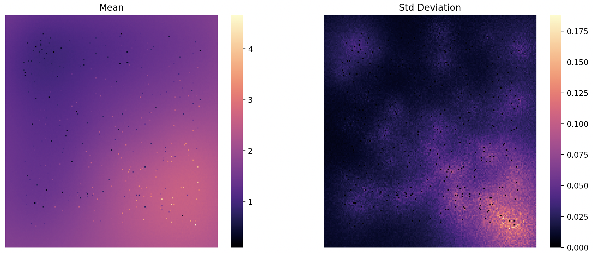

=====
Usage
=====

To use Fast Krig in a project::

    from fast_krig.examples.grids import generate_fake_grid
    from fast_krig.grid import Grid
    from fast_krig.utils import WorkForce
    from fast_krig.grid import Krig
    import fast_krig as fk
    import numpy as np
    import matplotlib.pyplot as plt
    import seaborn as sns

    grid = generate_fake_grid() # replace this with an actual grid for a real project
    krig = Krig(worker=grid, max_workers=4)
    krig(8)

    fig, ax = plt.subplots(1, 2)
    ax[0].set_title("Mean")
    ax[1].set_title("Std Deviation")
    for axs in ax:
        axs.get_xaxis().set_visible(False)
        axs.get_yaxis().set_visible(False)

    sns.heatmap(np.array(krig.aggregate_variance).squeeze(), cmap="magma", ax=ax[1])
    sns.heatmap(np.array(krig.aggregate_mean).squeeze(), cmap="magma", ax=ax[0])
    plt.show()

    
